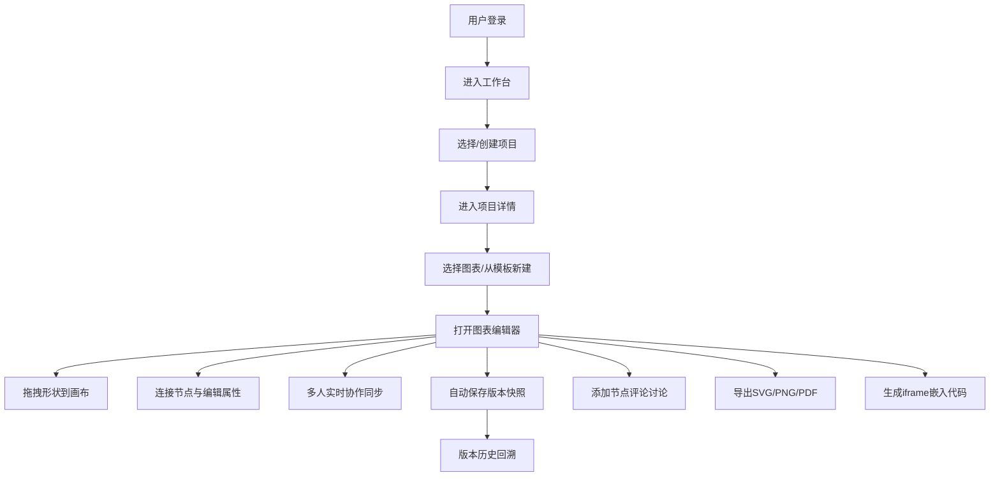

## 1. 产品概述

FlowSync 是一款面向技术团队的在线流程图与架构图协作编辑平台，支持多种图表类型的实时协作绘制、版本管理、注释讨论与多格式导出，帮助团队高效完成系统设计、业务梳理与技术沟通。

- 解决团队在架构设计、流程梳理中沟通效率低、版本混乱、协作困难的痛点
- 面向产品经理、架构师、开发工程师、运维工程师等技术协作角色

## 2. 核心功能

### 2.1 用户角色

| 角色 | 注册方式 | 核心权限 |
|------|----------|----------|
| 项目管理员 | 邮箱注册登录 | 创建/删除项目、管理成员权限、编辑所有图表 |
| 编辑者 | 邀请加入 | 编辑图表、添加注释、创建版本、导出图表 |
| 查看者 | 邀请加入 | 查看图表、浏览版本历史、添加评论、导出图表 |

### 2.2 功能模块

1. **项目管理页**：项目分组卡片、创建/编辑项目、成员权限管理、分享设置
2. **图表编辑器**：核心画布、形状库面板、属性面板、工具栏、协作面板
3. **图表列表页**：项目内图表列表、模板选择器、搜索/筛选、最近编辑
4. **版本历史面板**：时间线视图、版本对比、一键回滚、版本命名备注
5. **讨论注释面板**：节点评论、讨论线程、@提及、未读提示
6. **导出嵌入面板**：SVG/PNG/PDF导出、iframe嵌入代码生成、版本同步设置
7. **模板库面板**：分类模板展示、一键套用、自定义模板保存
8. **协作状态区**：在线用户头像列表、实时光标、操作提示

### 2.3 页面详情

| 页面名称 | 模块名称 | 功能描述 |
|----------|----------|----------|
| 登录页 | 登录表单 | 邮箱密码登录、记住登录、演示账号快捷入口 |
| 工作台首页 | 项目总览 | 项目卡片网格、最近编辑、快速创建入口、统计概览 |
| 项目详情页 | 图表列表 | 文件夹分组、图表卡片、搜索筛选、批量操作 |
| 图表编辑器 | 主画布区 | SVG无限画布、节点拖拽、连线绘制、缩放平移、网格对齐 |
| 图表编辑器 | 左侧形状库 | 按图表类型分类的形状面板、拖拽添加、搜索形状 |
| 图表编辑器 | 顶部工具栏 | 撤销/重做、缩放控制、视图切换、导出操作、协作状态 |
| 图表编辑器 | 右侧属性面板 | 节点样式设置、文本编辑、层级调整、对齐分布 |
| 图表编辑器 | 底部协作栏 | 在线用户列表、光标位置提示、当前操作提示 |
| 图表编辑器 | 版本侧边栏 | 版本时间线、快照预览、回滚操作、版本对比 |
| 图表编辑器 | 讨论侧边栏 | 节点评论列表、回复功能、@提及、未读标记 |
| 项目设置页 | 成员管理 | 成员列表、角色分配、邀请链接、移除成员 |
| 模板库页 | 模板展示 | 分类浏览模板、预览效果、一键使用 |

## 3. 核心流程

用户登录后进入工作台，查看或创建项目。进入项目后选择已有图表或从模板新建。编辑器中可从形状库拖拽节点到画布、连接节点、编辑属性。多人编辑时操作实时同步，光标实时可见。编辑过程中自动保存版本，可随时回滚。可对节点添加评论与团队讨论。完成后导出多种格式或生成嵌入代码集成到其他系统。

## 4. 用户界面设计

### 4.1 设计风格

**设计方向：专业科技感 + 深蓝工业风**

- 主色调：深靛蓝 `#1E3A5F`（专业可靠）、电光蓝 `#3B82F6`（交互高亮）
- 辅助色：翡翠绿 `#10B981`（在线/成功）、琥珀橙 `#F59E0B`（警告）、玫瑰红 `#F43F5E`（离线/错误）
- 中性色：石墨灰阶 `#0F172A` → `#F8FAFC`（12级灰阶体系）
- 画布背景：浅灰网格 `#F1F5F9` 配 20px 点阵网格
- 按钮风格：微立体扁平化，圆角 8px，悬停微光晕效果
- 字体：标题使用 Space Grotesk（几何工业感），正文使用 JetBrains Mono（等宽技术感）
- 布局风格：三栏式工作区（左侧形状库 | 中央画布 | 右侧属性/面板），顶部工具栏采用玻璃拟态
- 图标：Lucide 线性图标，1.5px 线宽，统一圆角
- 动效：Fast Out, Slow In 曲线，150-300ms，面板展开带轻微淡入位移

### 4.2 页面设计概览

| 页面名称 | 模块名称 | UI 元素 |
|----------|----------|----------|
| 登录页 | Hero区 | 左侧品牌展示（动态SVG架构图背景），右侧登录卡片（毛玻璃效果），渐变靛蓝背景 |
| 工作台首页 | 项目总览 | 顶部搜索+快速创建，统计卡片区（项目数/图表数/协作者数），项目卡片网格（带封面缩略图、成员头像组、最后编辑时间） |
| 图表编辑器 | 主画布区 | 无限SVG画布，网格点阵背景，节点选中态（双环边框+控制点），连线贝塞尔曲线+箭头，协作光标（带用户名标签） |
| 图表编辑器 | 形状库面板 | 可折叠分类Tab（流程图/泳道/ER/UML/拓扑），形状图标网格预览，拖拽时半透明跟随 |
| 图表编辑器 | 顶部工具栏 | 玻璃拟态背景，工具图标按钮组（撤销/重做/缩放/网格/对齐），协作头像堆，导出下拉菜单 |
| 图表编辑器 | 右侧面板 | Tab切换（属性/版本/讨论），属性面板含颜色选择器、字号滑块、边框样式；版本面板含垂直时间线；讨论面板含消息气泡 |
| 项目设置页 | 成员管理 | 成员列表卡片（头像+姓名+角色标签+操作），角色选择下拉（管理员/编辑者/查看者），邀请输入框 |

### 4.3 响应式

- 桌面端（>1280px）：三栏完整布局，形状库280px，属性面板320px，画布自适应
- 平板端（768-1280px）：左右面板可折叠收起为图标侧边栏，画布占主区域
- 移动端（<768px）：单栏布局，画布全屏，形状库和属性面板改为底部抽屉弹出，工具栏精简为图标

### 4.4 视觉细节

- 画布节点投影：`0 4px 20px rgba(30, 58, 95, 0.12)`，选中态增强 `0 8px 30px rgba(59, 130, 246, 0.25)`
- 面板过渡：展开时 `translateX(0) opacity(1)`，收起时 `translateX(-20px) opacity(0)`
- 协作光标：彩色圆角箭头 + 用户名小标签（用户名背景色与光标色一致），带细微跟随延迟
- 连线交互：悬停时高亮加粗，端点连接点显示为蓝色圆点磁吸
- 版本时间线：左侧蓝色竖线，节点为圆形标记，当前版本有脉冲光晕
