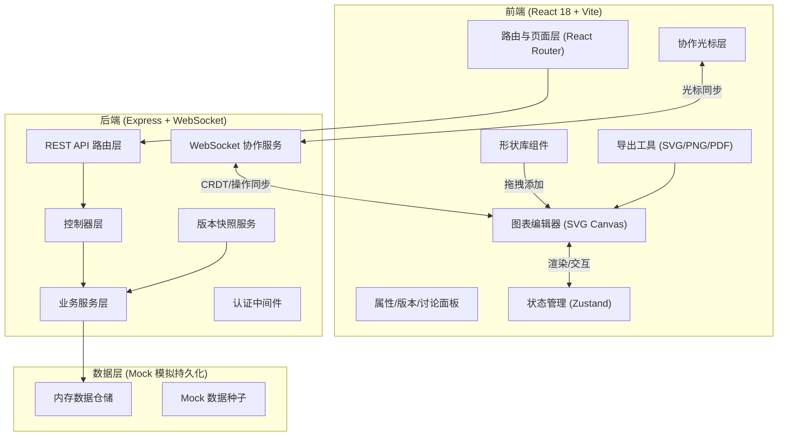
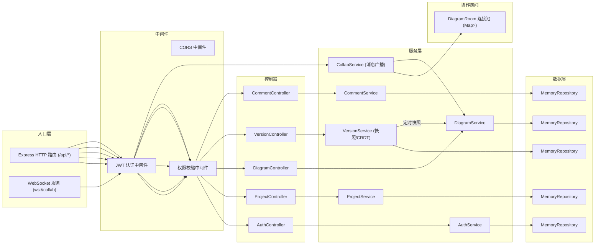
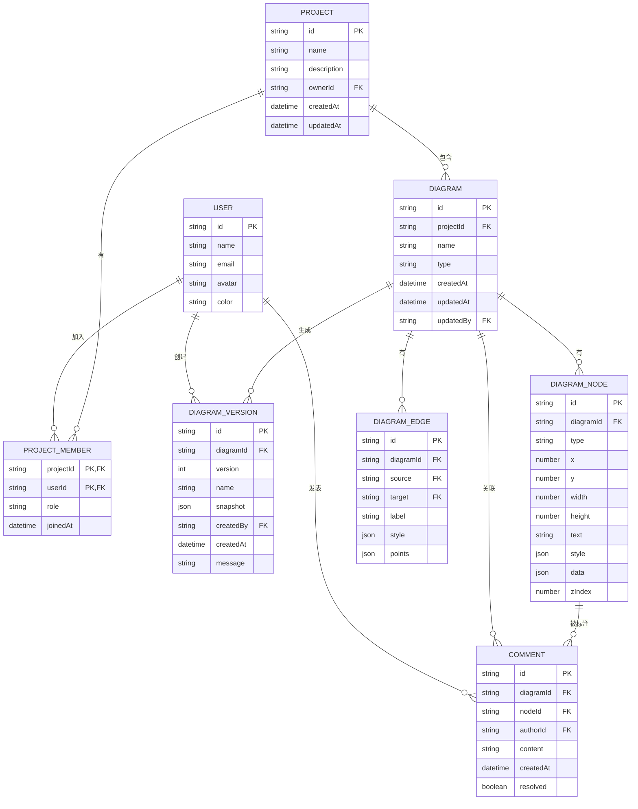

## 1. 架构设计



## 2. 技术描述

- 前端框架：React 18 + TypeScript 5
- 构建工具：Vite 5
- 样式方案：Tailwind CSS 3.4（自定义设计令牌）
- 状态管理：Zustand 4（分模块：图表/协作/UI/用户）
- 路由：React Router DOM 6
- 图标库：lucide-react
- 后端框架：Express 4 + TypeScript
- 实时通信：ws (WebSocket) + 简单操作广播协议
- 导出功能：原生 SVG 序列化、HTMLCanvasElement（PNG）、jsPDF（PDF）
- 初始化工具：vite-init（react-express-ts 模板）
- 数据存储：内存仓储 + Mock 种子数据（演示环境）
- 协作算法：简化版 OT（操作转换）+ 定时快照 + 自动版本保存

## 3. 路由定义

| 路由 | 页面组件 | 用途 |
|------|----------|------|
| `/login` | LoginPage | 用户登录页（含演示账号入口） |
| `/dashboard` | DashboardPage | 工作台首页，项目总览与快速入口 |
| `/projects/:projectId` | ProjectPage | 项目详情页，图表列表与管理 |
| `/editor/:diagramId` | EditorPage | 图表编辑器主工作区 |
| `/templates` | TemplatesPage | 模板库浏览与选择 |
| `/projects/:projectId/settings` | ProjectSettingsPage | 项目设置与成员权限管理 |
| `/embed/:diagramId` | EmbedPage | iframe 只读嵌入视图 |

## 4. API 定义

### 4.1 TypeScript 核心类型

```typescript
// 用户
interface User {
  id: string;
  name: string;
  email: string;
  avatar: string;
  color: string; // 协作光标色
}

// 项目
interface Project {
  id: string;
  name: string;
  description: string;
  coverThumbnail?: string;
  createdAt: string;
  updatedAt: string;
  members: ProjectMember[];
  ownerId: string;
}

interface ProjectMember {
  userId: string;
  role: 'admin' | 'editor' | 'viewer';
  joinedAt: string;
}

// 图表
type DiagramType = 'flowchart' | 'swimlane' | 'er' | 'sequence' | 'topology';

interface Diagram {
  id: string;
  projectId: string;
  name: string;
  type: DiagramType;
  thumbnail?: string;
  createdAt: string;
  updatedAt: string;
  updatedBy: string;
  nodes: DiagramNode[];
  edges: DiagramEdge[];
  viewport: Viewport;
}

// 画布节点
interface DiagramNode {
  id: string;
  type: string; // 形状类型标识
  x: number;
  y: number;
  width: number;
  height: number;
  text: string;
  style: NodeStyle;
  data?: Record<string, any>; // ER属性、泳道名等扩展数据
  zIndex: number;
}

interface NodeStyle {
  fill: string;
  stroke: string;
  strokeWidth: number;
  borderRadius: number;
  fontSize: number;
  fontColor: string;
  fontFamily: string;
  opacity: number;
}

// 连线
interface DiagramEdge {
  id: string;
  source: string; // node id
  target: string; // node id
  sourcePort?: 'top' | 'right' | 'bottom' | 'left';
  targetPort?: 'top' | 'right' | 'bottom' | 'left';
  label?: string;
  style: EdgeStyle;
  points?: { x: number; y: number }[]; // 贝塞尔控制点
}

interface EdgeStyle {
  stroke: string;
  strokeWidth: number;
  dashed: boolean;
  arrowStart: boolean;
  arrowEnd: boolean;
  curve: 'straight' | 'bezier' | 'orthogonal';
}

// 视口
interface Viewport {
  x: number; // 平移X
  y: number; // 平移Y
  zoom: number; // 缩放比例
}

// 版本快照
interface DiagramVersion {
  id: string;
  diagramId: string;
  version: number;
  name?: string;
  snapshot: Pick<Diagram, 'nodes' | 'edges' | 'viewport'>;
  createdBy: string;
  createdAt: string;
  message?: string;
}

// 评论/注释
interface Comment {
  id: string;
  diagramId: string;
  nodeId?: string; // 关联到具体节点，空则为全局
  authorId: string;
  content: string;
  createdAt: string;
  updatedAt: string;
  resolved: boolean;
  replies: CommentReply[];
}

interface CommentReply {
  id: string;
  authorId: string;
  content: string;
  createdAt: string;
  mentions: string[]; // user id list
}

// 协作消息
interface CollabMessage {
  type: 'cursor' | 'op' | 'join' | 'leave' | 'presence';
  userId: string;
  payload: CursorPayload | OperationPayload | PresencePayload;
  timestamp: number;
}

interface CursorPayload {
  x: number;
  y: number;
  viewport: Viewport;
  selectedNodeId?: string;
}

interface OperationPayload {
  opId: string;
  operations: Operation[];
}

type Operation =
  | { type: 'node:add'; node: DiagramNode }
  | { type: 'node:update'; nodeId: string; changes: Partial<DiagramNode> }
  | { type: 'node:delete'; nodeId: string }
  | { type: 'edge:add'; edge: DiagramEdge }
  | { type: 'edge:update'; edgeId: string; changes: Partial<DiagramEdge> }
  | { type: 'edge:delete'; edgeId: string }
  | { type: 'viewport:update'; viewport: Viewport };
```

### 4.2 REST 接口

| 方法 | 路径 | 描述 | 请求体 | 响应体 |
|------|------|------|--------|--------|
| POST | `/api/auth/login` | 登录（演示） | `{ email, password }` | `{ user, token }` |
| GET | `/api/auth/me` | 当前用户 | — | `User` |
| GET | `/api/projects` | 项目列表 | — | `Project[]` |
| POST | `/api/projects` | 创建项目 | `{ name, description }` | `Project` |
| GET | `/api/projects/:id` | 项目详情 | — | `Project` |
| PUT | `/api/projects/:id` | 更新项目 | `Partial<Project>` | `Project` |
| DELETE | `/api/projects/:id` | 删除项目 | — | `{ success }` |
| GET | `/api/projects/:id/members` | 成员列表 | — | `(User & { role })[]` |
| POST | `/api/projects/:id/members` | 添加成员 | `{ email, role }` | `ProjectMember` |
| PUT | `/api/projects/:id/members/:uid` | 更新角色 | `{ role }` | `ProjectMember` |
| DELETE | `/api/projects/:id/members/:uid` | 移除成员 | — | `{ success }` |
| GET | `/api/projects/:id/diagrams` | 项目图表列表 | — | `Diagram[]` |
| POST | `/api/diagrams` | 创建图表 | `{ projectId, name, type, templateId? }` | `Diagram` |
| GET | `/api/diagrams/:id` | 图表详情 | — | `Diagram` |
| PUT | `/api/diagrams/:id` | 更新图表（保存） | `Partial<Diagram>` | `Diagram` |
| DELETE | `/api/diagrams/:id` | 删除图表 | — | `{ success }` |
| GET | `/api/diagrams/:id/versions` | 版本历史列表 | — | `DiagramVersion[]` |
| POST | `/api/diagrams/:id/versions` | 创建命名版本 | `{ name?, message? }` | `DiagramVersion` |
| POST | `/api/diagrams/:id/versions/:vid/restore` | 回滚版本 | — | `Diagram` |
| GET | `/api/diagrams/:id/comments` | 评论列表 | — | `Comment[]` |
| POST | `/api/diagrams/:id/comments` | 新增评论 | `{ nodeId?, content }` | `Comment` |
| POST | `/api/diagrams/:id/comments/:cid/replies` | 回复评论 | `{ content }` | `CommentReply` |
| PATCH | `/api/diagrams/:id/comments/:cid` | 标记已解决 | `{ resolved }` | `Comment` |
| GET | `/api/templates` | 模板列表 | `?type` | `Template[]` |
| GET | `/api/diagrams/:id/embed` | 嵌入配置 | — | `{ embedCode, sync: boolean }` |

## 5. 服务端架构



## 6. 数据模型

### 6.1 ER 图



### 6.2 种子数据规划

- 3 个示例用户（不同颜色光标）：张三（#3B82F6 蓝）、李四（#10B981 绿）、王五（#F59E0B 橙）
- 2 个项目：「电商平台重构」「微服务基础设施」
- 5 张示例图表：
  - 流程图：用户下单流程
  - 泳道图：订单处理泳道
  - ER 图：电商数据模型
  - UML 时序图：支付回调时序
  - 网络拓扑图：K8s 集群架构
- 8 个模板：微服务架构、登录注册流程、数据库标准ER图等
- 若干版本快照与评论
